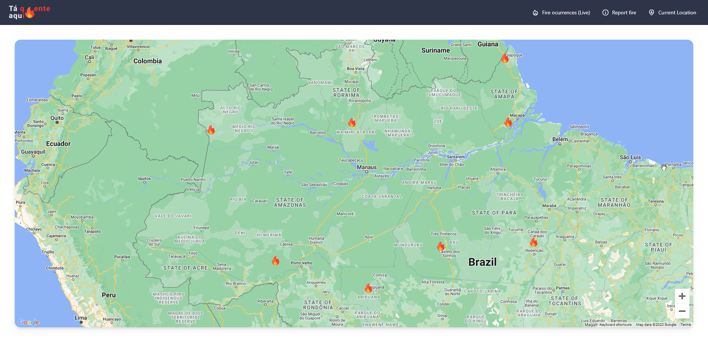

<h1 align="center">
    <br>
    
</h1>

<p align="center">
    Our solution is a web application designed to display and record global wildfires. Users will be able to view NASA-provided data in a simple, automated, and real-time manner, while also allowing them to report fire incidents. The project is user-friendly and adds value to the entire population, with a focus on real-time global wildfire display and monitoring. Users will have the ease of intuitively accessing NASA-provided data and reporting wildfires in their regions, actively contributing to the monitoring and control of these events.
<br/>
</p>

<p>
Our project consists of receiving user submissions through a database with important details about fire incidents, which users can utilize from anywhere in the world to report a fire.
We consult publicly available NASA data that monitors the entire world in real-time and reflect this data, updating it every minute. Data older than 48 hours is automatically removed from the system.
We provide an interface where the user can:
    
- Report a fire incident
- View a global map to understand where fire outbreaks are occurring
    
In the future, we can implement notifications for institutions involved in firefighting and property owners in specific regions, whether they are private or municipal.
</p>

[_👀 Project Demo_](https://www.youtube.com/watch?v=cfl8_BOlo_M)

## 🗂 Install

[Frontend](https://github.com/Merieli/hackaton-nasa-front) -
[Backend](https://github.com/jotope94/nasa-backend)

```bash
# Install the front-end of the project following the step-by-step instructions mentioned in the project's Readme below:
https://github.com/Merieli/hackaton-nasa-front

# Install the backend of the project following the step-by-step instructions mentioned in the project's Readme below:
https://github.com/jotope94/nasa-backend
```

## 📸 Preview



<br>

## Space Agency Data

Data Active Fire: https://firms.modaps.eosdis.nasa.gov/active_fire/

## References

- Image Presentation: https://www.pexels.com/pt-br/foto/silhueta-de-arvores-nuas-cercadas-de-fogo-durante-o-dia-50700/
- Icons used: https://fonts.google.com/icons
- Maps: https://developers.google.com/maps/documentation/javascript/overview
- Google Earth: https://earth.google.com/web/@-13.73843354,-61.09770324,203.80882337a,9065207.87887378d,30y,0h,0t,0r/data=OgMKATA

---

```diff
Made by Danilo Albergardi, João Lima and Merieli Manzano.
```

<p align="right">(<a href="#top">back to top</a>)</p>
